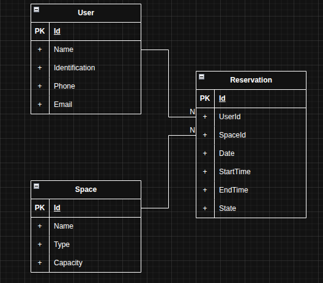
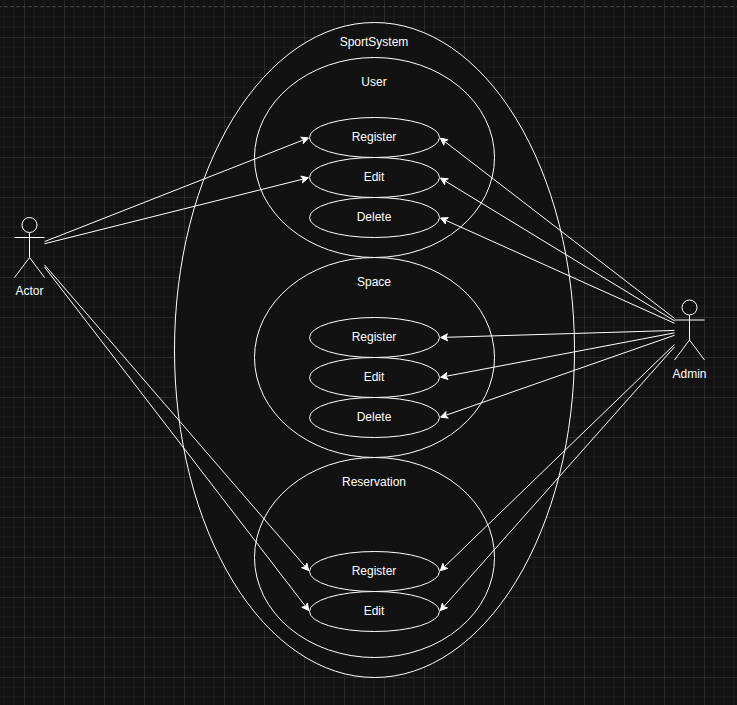

# SportSystem





## Overview

SportSystem is an ASP.NET Core web application for managing users, sports spaces, and reservations.
The solution uses Entity Framework Core with MySQL for persistence, and includes business logic to prevent schedule conflicts, ensure unique records, and notify users by email.

## Features

- User registration and editing with duplicate identity and email validation.
- Sports space management with filtering by type.
- Reservation lifecycle with creation, cancellation, and state management.
- Conflict validation for overlapping reservations by user and space.
- Email notifications for user, space, and reservation events.
- EF Core persistence using MySQL.

## Architecture and Flows

### Use Case Flows

#### User Management
- Register a new user with name, identification, phone, and email.
- Edit existing user information.
- Prevent duplicate users by identification and email.
- List all registered users.

#### Space Management
- Register a sports space with name, type, and capacity.
- Edit existing space details.
- Prevent duplicate spaces by name.
- Filter spaces by type.

#### Reservation Management
- Create reservations linking a user, space, date, start time, and end time.
- Prevent overlapping reservations for the same space.
- Prevent overlapping reservations for the same user.
- Prevent reservations in the past.
- Validate that end time is later than start time.
- Manage reservation states (`Scheduled`, `Cancelled`).
- Cancel reservations.
- List reservations by user and by space.

#### Notification Flow
- Send email notifications when a user is created.
- Send email notifications when a space is created.
- Send email notifications when a reservation is created or cancelled.

## Entity Flow

The application is based on three primary entities:

- `User`
  - `Id`, `Name`, `Identification`, `Phone`, `Email`

- `Space`
  - `Id`, `Name`, `SpaceType`, `Capacity`

- `Reservation`
  - `Id`, `UserId`, `SpaceId`, `Date`, `StartTime`, `EndTime`, `State`
  - Links to `User` and `Space`.

The `entity-flow.png` and `use-case-flow.png` diagrams illustrate the data model and user interaction flows.

## Database Setup

SportSystem uses MySQL for data persistence. Configure the database connection in `appsettings.json`.

Example `appsettings.json`:

```json
{
  "ConnectionStrings": {
    "DefaultConnection": "server=your_host;port=3306;database=your_database;user=your_user;password=your_password"
  },
  "Smtp": {
    "Host": "smtp.example.com",
    "Port": 587,
    "Username": "your_smtp_user",
    "Password": "your_smtp_password",
    "FromAddress": "no-reply@example.com",
    "FromName": "SportSystem",
    "EnableSsl": true
  },
  "Logging": {
    "LogLevel": {
      "Default": "Information",
      "Microsoft.AspNetCore": "Warning"
    }
  },
  "AllowedHosts": "*"
}
```

## Prerequisites

- .NET SDK 10.0
- MySQL server
- `dotnet-ef` global tool for database migrations

Install the EF tool if required:

```bash
dotnet tool install --global dotnet-ef
```

## Running Locally

1. Restore dependencies:

```bash
dotnet restore
```

2. Apply migrations:

```bash
dotnet ef database update
```

3. Run the application:

```bash
dotnet run
```

4. Open the application in the browser:

```text
https://localhost:5001
```

## Docker Support

A `Dockerfile` is included for building a container image of SportSystem.

Build the image:

```bash
docker build -t sportsystem:latest .
```

Run the container with MySQL and SMTP environment variables:

```bash
docker run -d \
  -p 5000:80 \
  -e ConnectionStrings__DefaultConnection="server=your_host;port=3306;database=your_database;user=your_user;password=your_password" \
  -e Smtp__Host="smtp.example.com" \
  -e Smtp__Port="587" \
  -e Smtp__Username="your_smtp_user" \
  -e Smtp__Password="your_smtp_password" \
  -e Smtp__FromAddress="no-reply@example.com" \
  -e Smtp__FromName="SportSystem" \
  -e Smtp__EnableSsl="true" \
  sportsystem:latest
```

Open the app at:

```text
http://localhost:5000
```

## Project Structure

- `Controllers/` - MVC controllers for user, space, reservation, and home features.
- `Models/` - Domain entities and enumerations.
- `Services/` - Business logic services and email notification service.
- `Data/` - EF Core database context.
- `Migrations/` - EF Core migrations.
- `Views/` - Razor views for the application UI.

## Notes

- The project uses `Pomelo.EntityFrameworkCore.MySql` for MySQL integration.
- SMTP settings are optional but required for email notifications.
- The app uses EF Core migrations to manage schema updates.
